# Medical Document Assistant · Evidence Lab

## Contents

- [Overview](#overview)
- [User workflow and scope](#user-workflow-and-scope)
- [Architecture](#architecture)
  - [Dialogue graph](#dialogue-graph)
  - [Retrieval variants and design decisions](#retrieval-and-alternatives)
  - [Business logic and API documentation](#business-logic-and-api-documentation)
- [Limitations of this local implementation](#limitations-of-this-local-implementation)
- [Dataset and evaluation method](#dataset-and-evaluation-method)
- [Evaluation results](#evaluation-results)
  - [What failed and why](#what-failed-and-what-the-comparison-can-explain)
- [Observability and cost](#observability-and-cost)
- [Verification and review](#verification-and-review)
- [Run locally](#run-locally)

### Project documentation

- [Backend architecture and contracts](backend/README.md)
- [Inference providers](backend/src/medical_assistant/providers/README.md)
- [Web interface](frontend/README.md)
- [Deployment and local development](deploy/README.md)
- [Isolated Codex configuration](config/codex/README.md)
- [Synthetic data examples and methodology](datasets/README.md)
- [Evaluation methodology and metrics](docs/evaluation/README.md)
- [Application screenshots](docs/screenshots/README.md)
- [Verification suite](tests/README.md)

## Overview

A locally deployable research workspace for asking questions across medical documents and inspecting the passages behind each answer. Upload English PDF or TXT originals, keep them in a shared collection, ask follow-up questions, open citations in the original document, and inspect retrieval, model usage and evaluation results.

The upload → indexing → MCP → LangGraph → cited-answer path is implemented and exercised through HTTP and Docker. **Answer quality is still a limitation:** the final synthetic comparison produced 79 answers from 80 planned attempts, but only 9 met the frozen strict grounded-success criterion. The strongest observed configuration passed 5/20. This is an inspectable engineering prototype, not a clinically validated assistant or a proven production deployment.

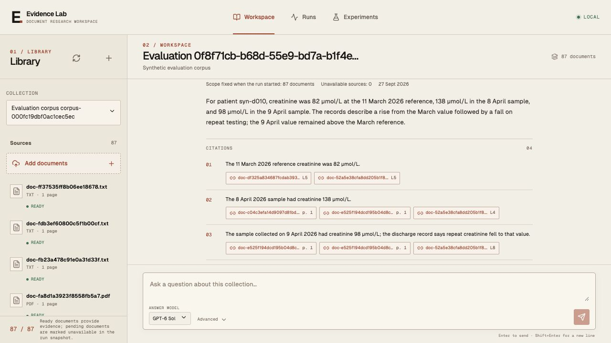

The screenshot shows a saved GPT 6 Sol answer using hybrid retrieval, reranking and an optional extra search. All examples and source documents are synthetic.

## User workflow and scope

1. **Library:** create or select a collection; upload native-text PDF or UTF-8 TXT; see ingestion state and delete sources. Each question searches all ready sources in that collection. Library pagination does not narrow retrieval.
2. **Conversation:** ask a question or follow-up, choose GPT 6 Sol or GPT 6 Luna, and optionally select a retrieval configuration. The UI shows committed run stages while work is in progress. The complete answer appears after validation; this is not token-by-token streaming.
3. **Evidence:** click a claim's citation to open a PDF page with a highlighted source line or a paginated TXT excerpt. Citations, source hashes and run scope remain associated with the saved answer.
4. **Runs:** browse the entire saved history with cursor pagination and status filtering. Execution status, answer status, graph latency and trace delivery are separate. A saved answer links to Langfuse; the trace includes a backlink to its application run.
5. **Experiments:** compare evaluated model and retrieval configurations, then inspect results by question or document class, evidence delivery, citation support and cost. Failed cases remain in the success-rate denominator.

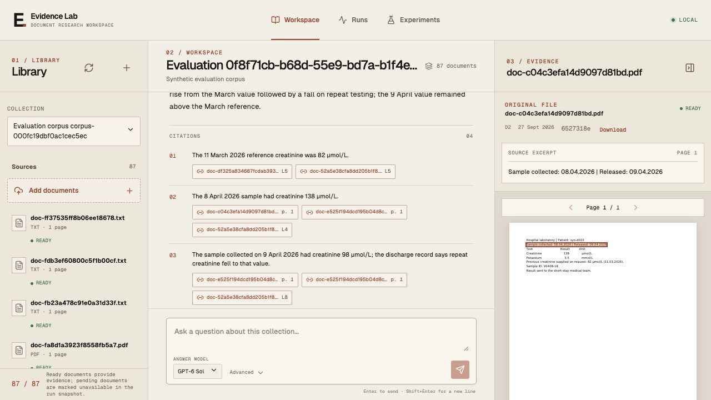

The accepted scope is one researcher with full access, English questions and documents, and one original format per source. There is no OCR, patient registry, validated cohort database, treatment recommendation workflow, RBAC, Kubernetes deployment or load-test claim. Language is a supported-workflow constraint, not an automatic language detector. A scanned PDF needs a separately validated OCR module. Group examples are possible; exhaustive distinct-patient counts are not inferred from top-k document retrieval.

For systematic patient-level queries, a future validated ETL pipeline into relational patient/event tables would make identities, event types and denominators explicit. That would support SQL counts and aggregates. Current RAG locates documentary facts and precedents; validated cohort counts require structured patient/event data.

## Architecture

One Python application is divided into an API/graph process, an ingestion worker, a read-only MCP child and a telemetry reconciler. PostgreSQL owns durable application state. Compose also runs the local Langfuse stack. The subscription CLI stays on the host behind a narrow authenticated bridge; the optional API provider fits the same inference contract.

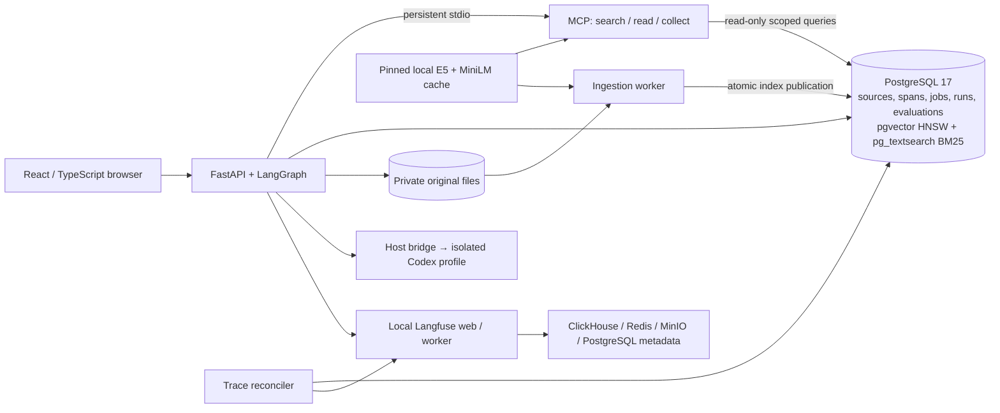

The [expanded container diagram](docs/diagrams/system-containers.mmd) records process and volume boundaries. Originals are immutable private files; the worker stores extraction spans and both chunk variants, then publishes the source and collection revision/counters in one transaction. Jobs use PostgreSQL leases and `SKIP LOCKED`, so no separate application queue is needed. Langfuse's Redis belongs to its own stack.

### Dialogue graph

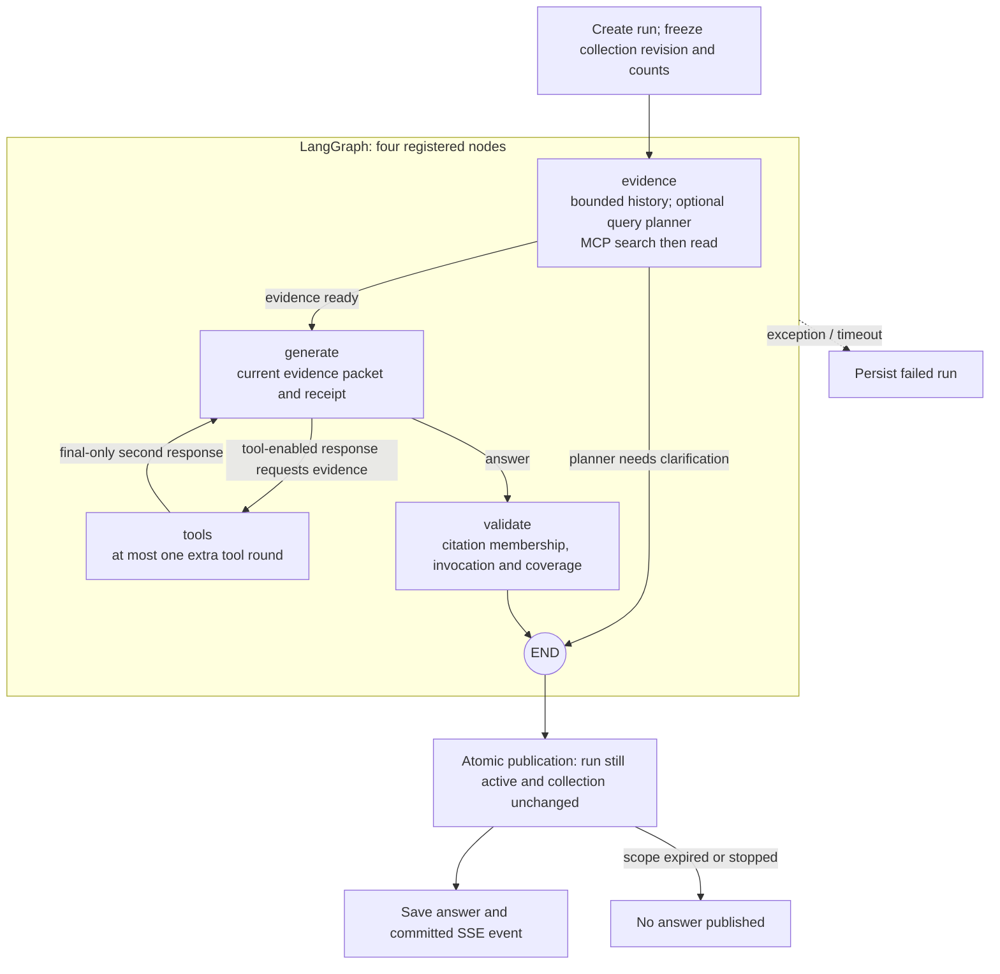

A follow-up or a question longer than 512 characters may add one planning call. The hybrid variants with tool use allow one additional bounded tool round, not an open-ended agent loop. The [detailed graph](docs/diagrams/dialogue-graph.mmd) includes packet/page budgets and cancellation. PostgreSQL stores conversations and run state; a restart marks unfinished runs interrupted, and a new inference requires an explicit run.

### Retrieval and alternatives

| Configuration | Candidate retrieval and context | Answer behavior | Final comparison |
| --- | --- | --- | --- |
| **Dense baseline (V0)** | Fixed chunks; HNSW cosine search | Basic citation prompt; one final answer from the initial evidence packet | GPT 6 Sol High and GPT 6 Luna High |
| **Hybrid search (V1)** | Structural chunks; HNSW + BM25 + identifier/phrase matching, combined by RRF | Basic citation prompt; one final answer | Implemented, not separately benchmarked |
| **Hybrid search with tool use (V2)** | Same hybrid search as above | Basic citation prompt; can request one extra search/read round | Implemented, not separately benchmarked |
| **Hybrid search with reranking and tool use (V3)** | Hybrid search followed by MiniLM cross-encoder reranking: up to 64 candidates reduced to 12 | Expanded prompt for dates, patient identity, medication status and complete citations; one optional extra tool round | GPT 6 Sol High and GPT 6 Luna High |

The V numbers are code/UI identifiers for these architecture modifications. The implementation is in [candidate search](backend/src/medical_assistant/candidate_search.py#L184), [reranking](backend/src/medical_assistant/reranking.py#L43), and [prompt/tool-round selection](backend/src/medical_assistant/graph.py#L1150). The final comparison tests the dense baseline against the full hybrid + reranking + tool-use variant; it does not isolate each modification.

Dense and BM25 branches each retrieve at most 100 candidates. Identifier and quoted-phrase branches start with at most 100 index-ordered BM25 candidates, verify matches within that pool and retain at most 20. Protected literal/phrase slots participate in the bounded RRF pool. Names and ordinary words use lexical/semantic retrieval; there is no authoritative patient-identity resolver. Frequently repeated identifiers can have matches outside the candidate cap, so an unsuccessful lookup is not proof of archive-wide absence.

| Decision | Why this choice; why not the alternative |
| --- | --- |
| **PostgreSQL + pgvector + pg_textsearch** | Source lifecycle, citation spans, indexes and run scope can share transactional publication/deletion. A second Qdrant/FAISS-style store introduces cross-system synchronization. |
| **HNSW cosine** | Indexed approximate nearest-neighbor retrieval supports incremental insertion without IVFFlat's training step. It costs index/build memory and can miss neighbors. Exact vector scans remain useful as a small correctness oracle, not the ordinary growing-library path. |
| **Indexed BM25** | Term rarity, frequency and document length matter for medical names, drugs and identifiers. `pg_textsearch` supplies index-ordered BM25 instead of substring scanning or sorting a complete posting set with basic FTS rank. |
| **RRF + bounded MiniLM** | RRF combines incomparable lexical/dense scores; a local cross-encoder can reorder a small pool without another external LLM request. It cannot recover candidates that never reached that pool. |
| **No SPLADE** | An additional learned sparse encoder/index needs a separate ingestion, versioning and query lifecycle. This project has no measured unique-recall gain to justify it. |
| **Collection partitions** | Each collection owns its chunk partition and fixed/structural HNSW plus structural BM25 indexes. Queries avoid a global ANN result subsequently filtered to a collection. The intended boundary is a few large research libraries, not millions of tiny tenant partitions. |
| **One persistent stdio MCP server** | Stdio serves one local consumer with three read tools, without a network listener, remote authentication or session routing. An in-process API would remove protocol overhead; stdio keeps the tool interface separate, while Streamable HTTP would suit independent remote consumers. |

See [backend contracts](backend/README.md) and [frontend behavior](frontend/README.md).

### Business logic and API documentation

Backend business functions have docstrings covering their purpose, input and output types, processing steps, state changes and failure semantics. They explain contracts such as when an answer can be published, what incomplete evidence means, and how missing usage affects cost estimates.

With the application running, browse [Swagger UI](http://127.0.0.1:8080/docs), [ReDoc](http://127.0.0.1:8080/redoc), or the generated [OpenAPI schema](http://127.0.0.1:8080/openapi.json). These describe request and response types, pagination, errors, file downloads and the event stream. To make authenticated requests in Swagger UI, enter the generated `PFL_SERVICE_TOKEN` using **Authorize**. Browser sessions use a session cookie and a CSRF header for mutations.

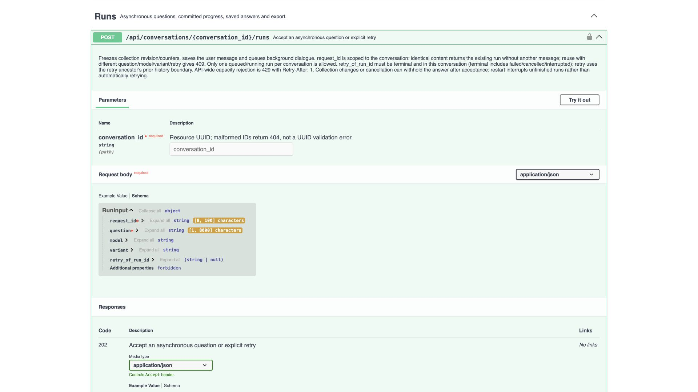

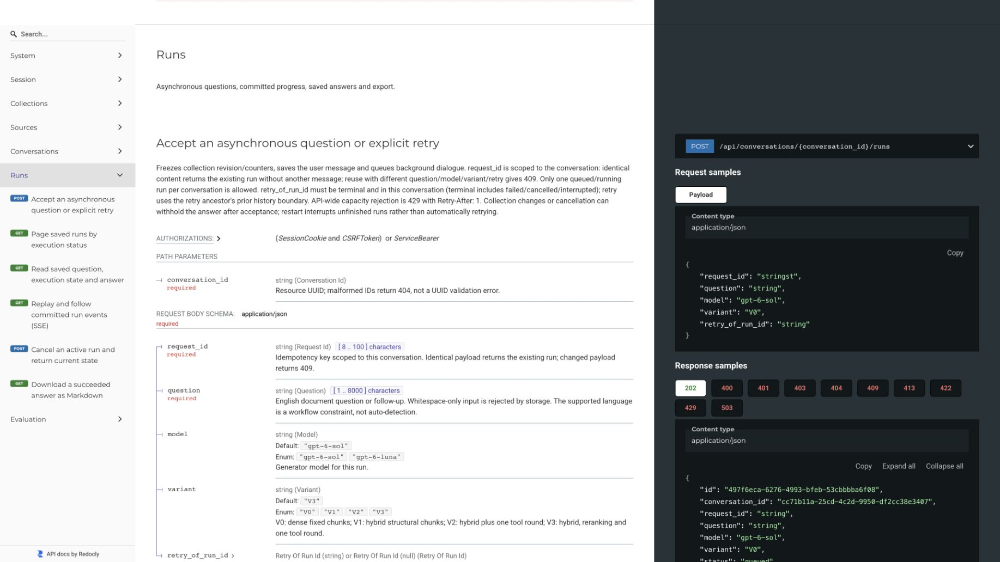

## Limitations of this local implementation

**Local CPU and RAM budget.** Development and measurement shared one personal computer with 16 GiB RAM and 10 CPU cores, rather than dedicated production infrastructure; the Docker VM had about 7.8 GiB RAM available. PostgreSQL, the application, ingestion and the entire Langfuse stack competed for its resources. Embedding and reranking run on CPU, with four inference threads each; Docker limits PostgreSQL to 768 MiB, the API/MCP process to 1.5 GiB and the worker to 2 GiB. These limits and four concurrent evaluation workers affect the recorded timings. The [container limits](deploy/app.compose.yaml#L74) and [model settings](backend/src/medical_assistant/settings.py#L20) are explicit.

**A small embedding model.** Retrieval uses `multilingual-e5-small` and **384-dimensional vectors**, chosen to fit local CPU/RAM constraints. A production deployment can evaluate larger encoders, including models with 3072-dimensional output; for example, [OpenAI documents 3072 dimensions for text-embedding-3-large](https://developers.openai.com/api/docs/guides/embeddings). That alternative was not benchmarked here. Dimensionality alone is not a quality score: changing the encoder requires re-embedding the corpus, updating the index representation and measuring retrieval quality and resource use. The current [embedding implementation](backend/src/medical_assistant/embedding.py#L25) always uses CPU.

**Timings belong to this environment.** A properly provisioned dedicated host should reduce resource contention and improve local embedding, reranking and database work. The reported latency is not a production expectation. Its end-to-end improvement cannot be quantified from this run: generation and judging execute at an external provider, so local hardware does not determine all of their delay. No production-hardware or load comparison was performed.

**Bounded evidence and source changes.** Each answer receives a limited selection of passages, not the whole archive. A source update expires an in-flight answer's collection revision and prevents publication. This supports a relatively stable research library; continuous ingestion would need versioned indexes or another snapshot policy. There is one API owner per database, and no multi-API high availability or RBAC. Cohort counts still require validated structured patient/event data.

**Local security boundary.** Private files, loopback ports, session/CSRF and Host/Origin checks protect the local workflow. The Codex role profile and parser subprocess isolate configuration/process state, not the operating system. Source text is treated as untrusted evidence; the tested portal-instruction example does not prove immunity to all prompt injections.

## Dataset and evaluation method

Evaluation used **87 synthetic English originals: 34 PDF and 53 TXT**, grouped into 44 source families. Each source had one format. The five document classes were clinical notes (36), laboratory/microbiology reports (18), medication records (20), discharge records (7) and imaging reports (6). No personal medical data was used. The repository includes [three small examples](datasets/README.md).

GPT 6 Astra served as orchestrator; GPT 6 Sol High agents acted as authors, source readers, adversarial reviewers and adjudicators. They drafted fictional timelines, challenged chronology and unsupported investigations, checked originals and extraction, and agreed on required claims and acceptable evidence alternatives. Questions, expected claims and the scoring rubric were fixed before generating candidate answers.

Twenty questions covered five tasks: finding examples, extracting facts in context, following a timeline, comparing sources and interpreting a reported number. Each task had four questions, including one two-turn dialogue. For those dialogues, **only the second answer was evaluated**; the first turn supplied conversational context. Every configuration searched the same 87-document collection. Expected answers and offline document labels never filtered retrieval.

The comparison was **20 questions × two retrieval architectures × GPT 6 Sol High/GPT 6 Luna High = 80 cases**. GPT 6 Sol High judged each completed answer. Strict success required the correct answer status, every required fact, supported claims and valid citations. A fully supported answer about an unresolved issue can be `supported`; `partial` means the question remains incompletely answered. The [evaluation method](docs/evaluation/README.md) defines all statuses and metrics. The common model used for gold review, judging and one generator may introduce correlated errors; independent clinical validation was not performed.

## Evaluation results

**Strict success is deliberately an all-or-nothing, zero-defect gate.** Every required fact must be present, every material claim must be fully supported by its citations, scope-wide conclusions must have valid coverage, and the answer status must exactly match the gold label. Judge and machine checks must all pass. One omitted fact, incomplete citation or incorrect status label makes the entire case unsuccessful, with no partial credit for everything it answered correctly. The best result of 25% therefore measures answers meeting **every condition simultaneously**, not the percentage of correct statements or useful answers.

A product-specific acceptance policy could score factual support, completeness and usefulness separately, credit useful bounded partial answers, and tolerate a conservative status label while retaining hard checks on unsupported claims and fabricated references. Such a policy could produce substantially higher acceptance rates. For example, [three otherwise satisfactory answers failed solely because they used `partial`](docs/evaluation/analysis.md#follow-up-examples). There is no universal “production-level” threshold; a more permissive acceptance rate was not measured here, so the table retains the original strict scores.

| Configuration | Strict success / planned | Completed | Judge assessable | Whole completed-case latency p50 / p90 |
| --- | ---: | ---: | ---: | ---: |
| Dense baseline · GPT 6 Luna High | **1/20 (5%)** | 20/20 | 20/20 | 31.0 / 49.3 s · n=20 |
| Dense baseline · GPT 6 Sol High | **2/20 (10%)** | 20/20 | 20/20 | 26.6 / 56.0 s · n=20 |
| Hybrid + reranking + tool use · GPT 6 Luna High | **1/20 (5%)** | 19/20 | 19/20 | 35.6 / 61.7 s · n=19 |
| Hybrid + reranking + tool use · GPT 6 Sol High | **5/20 (25%)** | 20/20 | 20/20 | 44.3 / 99.4 s · n=20 |

**79 of the 80 planned cases produced an answer, and all 79 answers received a judge verdict.** Nine met every strict requirement. The single execution failure was the hybrid architecture with GPT 6 Luna on the [kidney-infection follow-up question](docs/evaluation/analysis.md#pyelonephritis-sample-discharge): it returned 16 citation identifiers, of which one did not exist in the supplied evidence, search candidates or stored source spans. The [citation validator](backend/src/medical_assistant/graph.py#L1219) rejected the response, so its second turn was not attempted. GPT 6 Luna invented a source-reference identifier; this does not by itself prove that the medical statement was false.

The 80 cases involved **99 dialogue runs and 133 generation/planning calls**. Five two-turn questions across four configurations add 20 potential second turns; one first-turn failure prevented its second turn, giving 80 + 20 − 1 = 99 runs. Query planning and extra tool rounds add model calls within a run.

Hybrid + reranking + tool use with GPT 6 Sol passed three more paired questions than the dense baseline (+15 percentage points); GPT 6 Luna had the same success count in both variants. A paired bootstrap over the 20 questions gives a 95% interval of 0–30 points. This describes sensitivity within this deliberately assembled set: question groups can share source documents and are not independent patient samples. The comparison changes retrieval, prompts and tool use together, so it cannot isolate the effect of reranking.

Latency here sums both turns of completed two-turn cases and excludes evaluation queue wait, judge time and trace delivery. The UI's **Answer latency** instead measures the target turn alone; **Whole case latency** matches this table. Four concurrent case workers share the local runtime, so these are observed durations rather than a service guarantee.

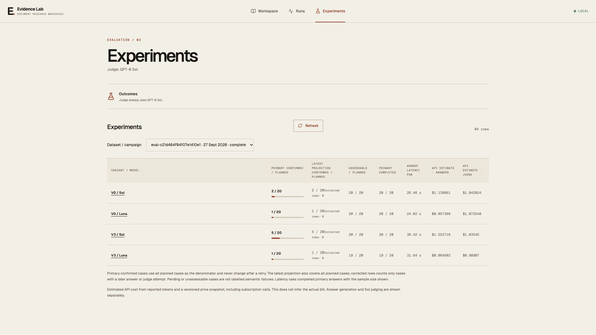

[Metric definitions](docs/evaluation/README.md) explain the denominators. Results grouped by required document class can overlap and must not be summed as disjoint groups.

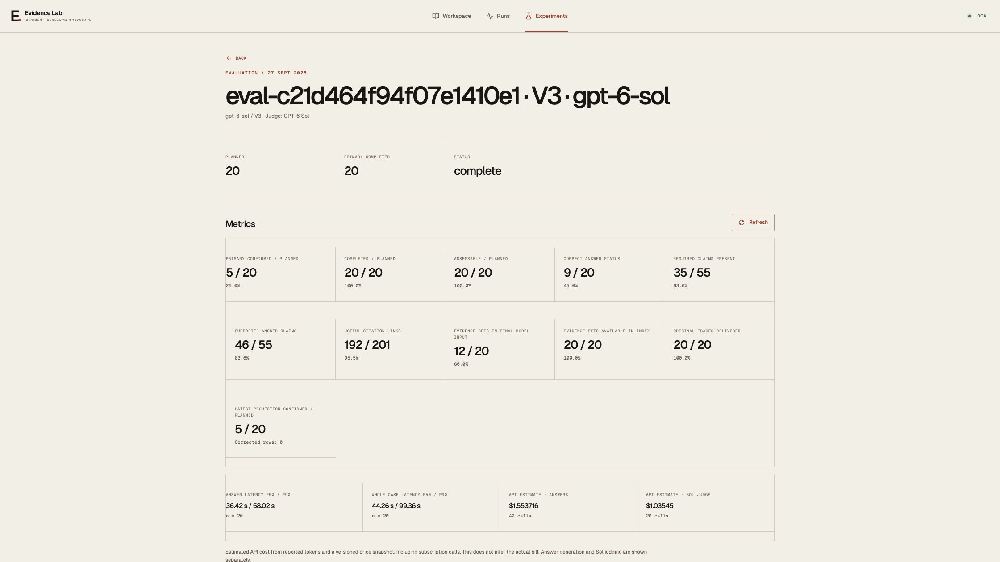

### What failed, and what the comparison can explain

| Finding | Observed result | Implication |
| --- | --- | --- |
| Answer-status calibration | [Follow-up examples](docs/evaluation/analysis.md#follow-up-examples): three answers supplied enough supported examples but failed only because they labelled the answer `partial`. | Incomplete archive coverage does not make a complete answer to a request for examples partial. |
| Evidence lost after an extra search | [Three diagnosis timelines](docs/evaluation/analysis.md#three-diagnosis-timelines): both runs of the hybrid architecture (GPT 6 Sol High and GPT 6 Luna High) initially received complete annotated support for four of seven required facts; after repacking, only two retained that support. | A second search can displace useful passages from a fixed-size context. These fractions count supported expected facts, not documents. |
| Complete citations | [Creatinine values over time](docs/evaluation/analysis.md#creatinine-trend): some answers gave the right values without citing all the date and identity lines needed to support the claim. | A correct number alone is not a fully supported attributed result. |

Complete annotated support for every required positive claim reached the final input in 18/20 dense-baseline GPT 6 Luna cases and 17/20 dense-baseline GPT 6 Sol cases, versus 10/19 answered hybrid GPT 6 Luna cases and 12/20 hybrid GPT 6 Sol cases. This checks specific acceptable passage sets; other evidence may also support an answer. It does not measure general semantic recall. The [combined analysis](docs/evaluation/analysis.md) examines medication timelines, conflicting records, source instructions and supported comparisons. The stored audit does not retain every pre-rerank candidate identifier, so individual retrieval losses cannot always be localized.

## Observability and cost

PostgreSQL stores every planned attempt and the authoritative run audit. Langfuse receives generation, query-planning and MCP observations with stable operation IDs; search observations include per-lane counts/timings, fusion and reranker details. Model/token usage, evidence scope, errors and evaluation scores are linked to the saved run. Reconciliation checks exact expected operation and score IDs rather than equating a successful SDK flush with delivery.

Observations connect each answer to its search/read operations, generator usage and judge verdict. The evaluation includes 99 dialogue runs, 79 judged answers and 158 evaluation scores. The one rejected answer has a diagnostic trace. Dashboard trace records include different operation types and therefore are not the same count as the 80 evaluation cases.

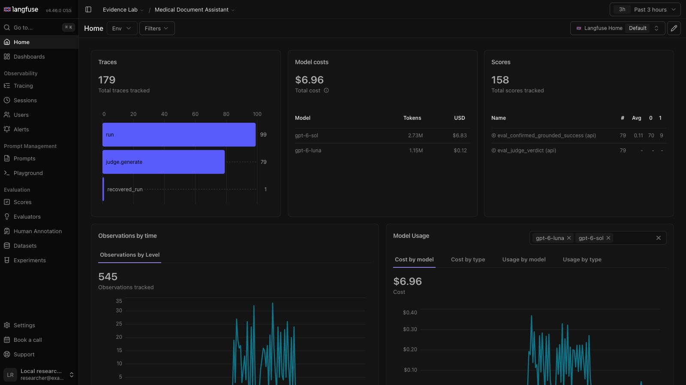

| Work | Calls | API-equivalent cost |
| --- | ---: | ---: |
| Answer generation and query planning | 133 | **~$2.82** |
| GPT 6 Sol judging | 79 | **~$4.14** |
| **Total** | **212** | **~$6.96** |

These are estimates from reported tokens and a fixed API price schedule, rounded to cents. Calls used the subscription-backed provider: the table answers “what would this work cost at API rates?”, not “what did the subscription charge?”. Totals are calculated from unrounded values and then rounded, so rounded components can differ from their displayed total by a cent. Langfuse's GPT 6 Sol model total combines GPT 6 Sol answers and GPT 6 Sol judging; the report separates them. Cached input is counted once, and reasoning tokens are not added to output twice.

The trace view shows search/read/generation, timing and scores for the illustrated answer.

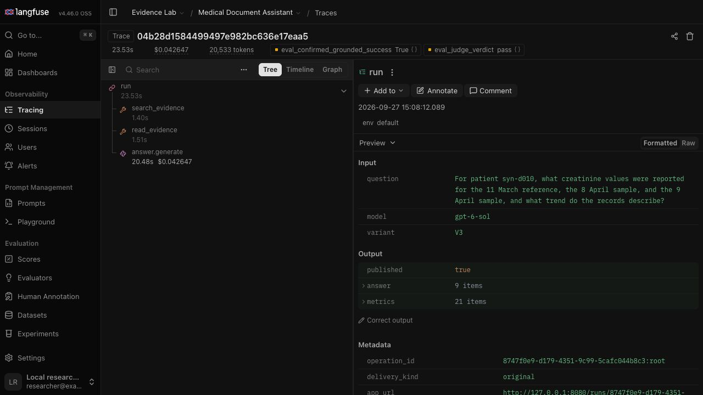

The Runs screen browses all application history. This illustration temporarily uses 10 rows per page; the application’s pagination setting is unchanged. Its four technical runs outside the evaluation campaign are excluded from the report’s metrics and costs.

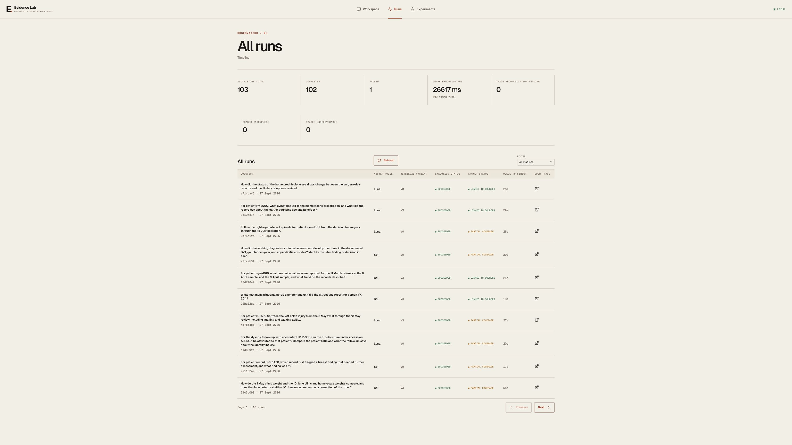

The TXT evidence example shows an incomplete answer and the cited cancellation line.

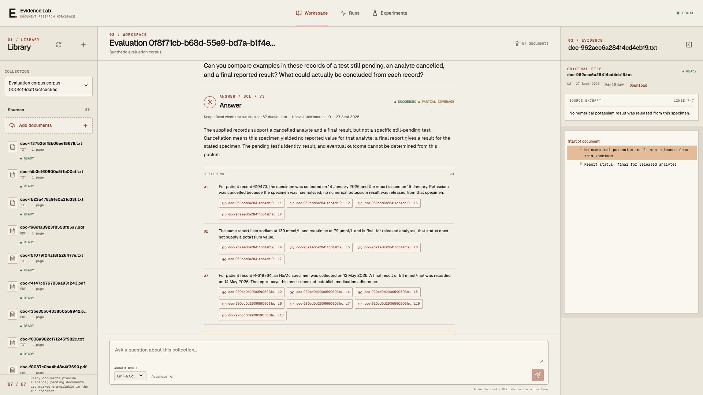

## Verification and review

Six E2E scenarios exercise FastAPI routes through an in-process TestClient, real PostgreSQL, parser/worker behavior, local embeddings/reranking and stdio MCP. Model fixtures make generation and judging deterministic.  [Test preparation and coverage](tests/README.md) define the verification boundary.

A separate Docker integration exercised network HTTP upload → worker → E5 → BM25/HNSW → MiniLM → three MCP tools → cited answer → Langfuse readback. Observed peak memory on that path was approximately 1.04 GB for API/MCP and 1.38 GB for the worker. This verifies local packaging, while the model evaluation above measures answer quality.

## Run locally

The tested environment is macOS with a running OrbStack/Docker Compose installation, `uv`, Python 3.13, and **`codex-cli 0.156.1` at `/opt/homebrew/bin/codex`**, signed into an account with access to the configured models. The CLI launcher deliberately checks that version and path. Its host bridge relies on OrbStack's `host.docker.internal` access to a host loopback listener; other hosts are not verified. Docker builds the frontend itself.

From the repository root:

```sh
uv run --project . python deploy/configure.py
uv run --project . python config/codex/install_profiles.py
bin/pfl-codex login
docker compose --env-file tmp/work/runtime/.env -f deploy/compose.yaml build postgres
docker compose --env-file tmp/work/runtime/.env -f deploy/compose.yaml up -d --wait
docker compose --env-file tmp/work/runtime/.env -f deploy/compose.yaml -f deploy/app.compose.yaml build api
docker compose --env-file tmp/work/runtime/.env -f deploy/compose.yaml -f deploy/app.compose.yaml run --rm --no-deps model-prepare
```

Start the subscription provider bridge in a separate host terminal and leave it running:

```sh
uv run --project . python -m medical_assistant.providers.bridge
```

Start the application:

```sh
docker compose --env-file tmp/work/runtime/.env -f deploy/compose.yaml -f deploy/app.compose.yaml up -d --no-deps --wait api worker reconciler
curl --fail http://127.0.0.1:8080/api/health
curl --fail http://127.0.0.1:8080/api/readiness
```

Open `http://127.0.0.1:8080/#token=<PFL_LAUNCH_TOKEN>`, replacing the placeholder with the generated value in the private `tmp/work/runtime/.env`. Create a collection, upload files and wait for **Ready** before asking a question. CLI readiness checks the bridge configuration and reachability without making an inference call.

Langfuse runs at `http://127.0.0.1:3045`: sign in as `researcher@example.invalid` with `LANGFUSE_USER_PASSWORD` from that same private environment file, then open project `pfl-assistant`. The [example files](datasets/README.md) provide one PDF and one TXT for upload, plus an illustrative JSON question and expected result.

See [deployment instructions](deploy/README.md) for native development, resource limits and the optional Responses API adapter. The API adapter has offline contract validation; a paid live API request was not tested. Initial model preparation downloads pinned public E5/MiniLM artifacts when needed. Normal ingestion and search use the prepared local cache without downloading models during a request.
